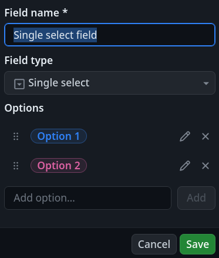
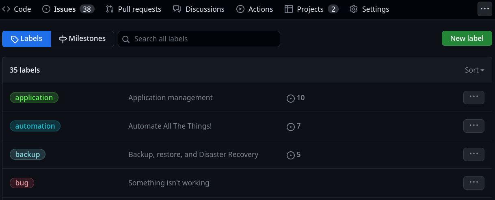

---
tags:
  - project
  - github
  - label
  - milestone
  - workflow
  - status
  - pull request
  - issue
  - review
  - dod
  - definition of done
---

# GitHub Project

See GitHub's documentation for [Planning and tracking with Projects](https://docs.github.com/en/issues/planning-and-tracking-with-projects)

## Project creation and basic configuration

## Access management

## Custom fields

### Text, number, and date

Just bare free text and number fields

Examples: start and end dates for project items

### Single select

#### Configuring project items statuses

!!! note
    GitHub's "Team Backlog template" defines the following statuses:

    🆕 New > 📋 Backlog > 🔖 Ready > 🏗 In progress > 👀 In review > ✅ Done

* 📚 No status: product/project backlog
* 📌 To-Do: Iteration/sprint backlog
* 📐 Design: Design and planning
* 👩‍💻 Dev: Development
* 🧪 Test: Test development and CI
* 📖 Docs: Docs writing
* 👀 Review: Waiting for review
* 🏁 Done: Closed (finished or dropped)

These statuses correspond to the columns in the Kanban board view of the project.

Items and issues should be ordered by priority, top to bottom, in each column.

Not all steps are mandatory, and items can jump statuses, or step out before reaching the `Done` status (abandonned, won't fix,...).
Nevertheless, exceptional cases (urgent fix) aside, items should step into the board in the project backlog.
They will wait there to be prioritized, then moved to the iteration backlog during a sprint planning session.

Work in progress should be limited to the capacity of a single iteration.

Ideally, only the project backlog and the `Done` columns should be populated at the end of each iteration.

The `Done` column can be cleaned up by archiving old or insignificant items.

#### Configuring items priorities

TODO: Explain project items priorities

* 🌋 Urgent
* 🏔 High
* 🏕 Medium
* 🏝 Low

#### Configuring items sizes

TODO: Explain project items sizes

* 🐋 X-Large
* 🦑 Large
* 🐂 Medium
* 🐇 Small
* 🦔 Tiny

### Iterations

TODO: Study and implement iterations management

## Boards columns limits

Limit **Work In Progress (WIP)** for each step of the items workflow and, cummulatively, WIP for the whole board.

## Workflows

* Item added to project
* Item reopened
* Item closed: set Status as `🏁 Done`
* Code changes requested: set status as `📌 To-Do`
* Code review approved
* Pull request merged: set Status as `🏁 Done`
* Auto-archive items
* Auto-add to project:
  * Filters: is:issue,pr
  * Action: Add the item to the project

## Labels

TODO: Document labelling "axes" and corresponding labels created

See [Managing labels](https://docs.github.com/en/issues/using-labels-and-milestones-to-track-work/managing-labels) for more information.

## Milestones

Create milestones from the given project planning steps descriptions.

Note that milestones being ordered alphabetically in the Roadmap view, it is better to have their names "follow" their chronology, like with a simple sequence numerotation at the begining or their names.

Next issues pertaining to each milestones should be created and linked to them.

Depending on their size

Issues can be reordered in the milestone view by simple drag and drop.

See [Using labels and milestones to track work](https://docs.github.com/en/issues/using-labels-and-milestones-to-track-work) for more information.

## References

* https://docs.github.com/en/issues/planning-and-tracking-with-projects/learning-about-projects/best-practices-for-projects
* https://docs.github.com/en/issues/managing-your-tasks-with-tasklists/creating-a-tasklist
* https://docs.github.com/en/issues/using-labels-and-milestones-to-track-work/about-milestones
* https://docs.github.com/en/issues/using-labels-and-milestones-to-track-work/managing-labels
* https://docs.github.com/en/issues/planning-and-tracking-with-projects/automating-your-project/using-the-built-in-automations
* https://docs.github.com/en/issues/planning-and-tracking-with-projects/automating-your-project/adding-items-automatically
* https://docs.github.com/en/actions/managing-issues-and-pull-requests/using-github-actions-for-project-management
