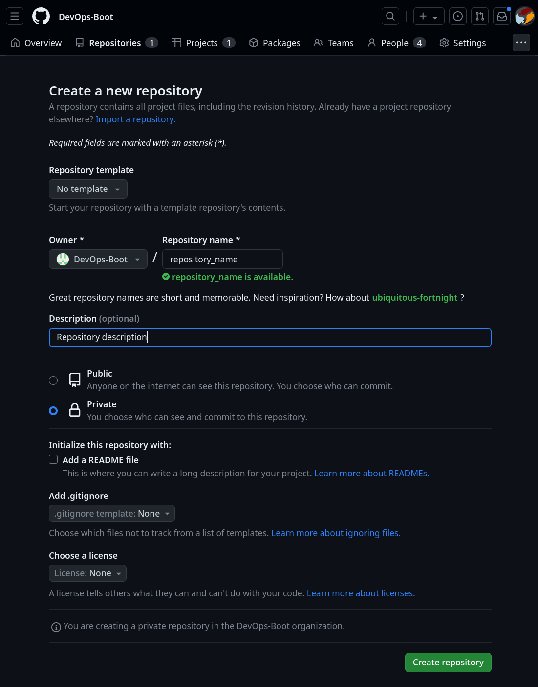
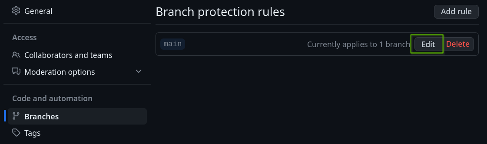

---
tags:
  - git
  - github
  - repository
---

# Source code management

## Repository creation

## Repository settings

### General settings

### Code and automation

#### Branches protection rules

#### Tags

TODO: [Protected tags configuration](https://github.com/DevOps-Boot/fastapi-k8s/settings/tag_protection)

#### Actions general settings

TODO: [Actions general settings](https://github.com/DevOps-Boot/fastapi-k8s/settings/actions)

#### Environments

TODO: [Environements configuration](https://github.com/DevOps-Boot/fastapi-k8s/settings/environments)

### Security

#### Code security and analysis

* [About secret scanning](https://docs.github.com/en/enterprise-cloud@latest/code-security/secret-scanning/about-secret-scanning#about-secret-scanning-for-partner-patterns)
* [Suppported secrets](https://docs.github.com/en/code-security/secret-scanning/secret-scanning-patterns#supported-secrets)

#### Secrets and variables

## Repository organization

### Monorepository

### Main directories and files

* app
* scripts
* README.md

## Methodologies and best practices

* Conventional commits (sort of)
* Markdown formating:
  * commit messages
  * issues
* Feature branches
* Rebase merge
* Review
* Docs and tests
* Versioning and releases
